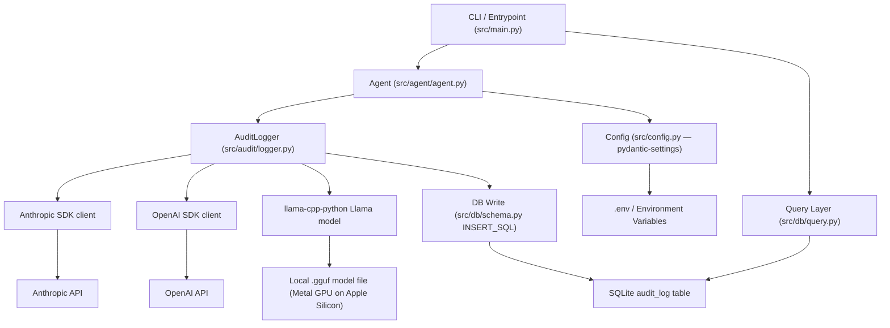

# System Architecture

## Overview
`ai-decision-audit-log` is a local Python library and CLI tool. It wraps AI SDK calls
(Anthropic, OpenAI, llama-cpp-python) to intercept decision context — prompts, completions,
model metadata, latency, token counts, and caller tags — and persists them to a structured
local SQLite audit store. A query layer allows retrieval and export of stored entries.

## Runtime Targets
- **Local:** primary runtime — development, prototyping, direct CLI use
- **Cloud:** not targeted yet
- **Edge:** Raspberry Pi supported conditionally via `HARDWARE_ENABLED=false`

## Component Map



## Layer Responsibilities

| Layer | Module | Responsibility |
|---|---|---|
| CLI / Entrypoint | `src/main.py` | argparse command dispatch: capture \| query \| export \| summary |
| Agent | `src/agent/agent.py` | Routes calls to correct provider via closure-wrapped call_fn |
| Audit Logger | `src/audit/logger.py` | Pre/post hooks, latency timing, LogEntry write to SQLite |
| DB — Schema | `src/db/schema.py` | DDL + `ensure_schema()`, `INSERT_SQL` constant |
| DB — Connection | `src/db/connection.py` | Context manager over `sqlite3.connect()` |
| DB — Query | `src/db/query.py` | 5 query functions returning `list[LogEntry]` |
| Models | `src/models/log_entry.py` | `LogEntry` Pydantic model, `LogStatus` enum, SQLite serialisation |
| Config | `src/config.py` | `pydantic-settings` BaseSettings, loaded once at startup |

## Data Flow

```
agent.chat(prompt, session_id, user_id, provider)
        ↓
Agent._chat_<provider>() builds a closure (_call) capturing model + params
        ↓
AuditLogger.log_call() — pre-hook: UUID, ISO timestamp, start perf_counter
        ↓
_call() — provider SDK executes (Anthropic / OpenAI / llama-cpp-python)
        ↓
Post-hook: compute latency_ms, extract response + tokens via injected extractors
        ↓
LogEntry Pydantic model validated
        ↓
INSERT INTO audit_log → SQLite commit
        ↓
Response text returned to caller (transparent passthrough)
        ↓
CLI query / export: get_by_session | get_by_user | get_errors | get_model_usage_summary
```

## Key Constraints
- Secrets never leave the environment layer; config loaded once via BaseSettings
- All provider clients injected into Agent — never instantiated inside AuditLogger
- Audit store is append-only; no entry is ever mutated after write
- llama-cpp-python model loaded lazily on first use (deferred startup cost)
- `sqlite3` stdlib only — no ORM, no SQLAlchemy
- Tests use `:memory:` DB — no disk I/O, no fixture cleanup
- llama_cpp import deferred — not imported unless `provider="llama_cpp"` is used
